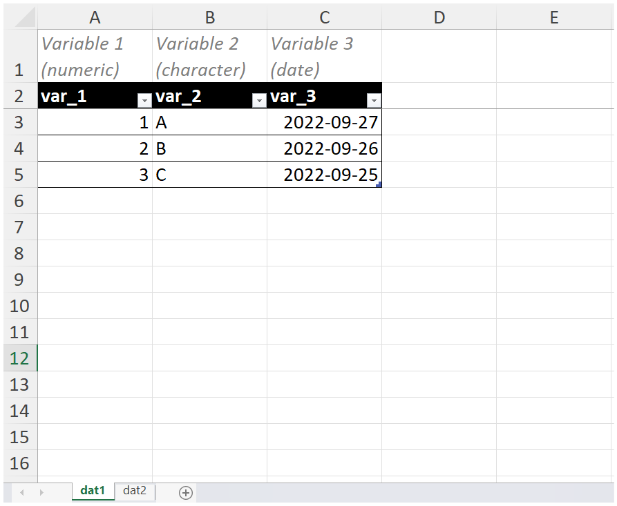

<!-- README.md is generated from README.Rmd. Please edit that file -->

```{r, include = FALSE}
knitr::opts_chunk$set(
  collapse = TRUE,
  comment = "#>",
  fig.path = "man/figures/README-",
  out.width = "100%"
)
```

# croquet

<!-- badges: start -->
[](https://lifecycle.r-lib.org/articles/stages.html#experimental)
[](https://CRAN.R-project.org/package=croquet)
[](https://app.codecov.io/gh/pcctc/croquet?branch=main)
[](https://github.com/pcctc/croquet/actions/workflows/R-CMD-check.yaml)
<!-- badges: end -->

A collection of clinical research organization (CRO) miscellaneous functions 
developed for [The Prostate Cancer Clinical Trials Consortium (PCCTC)](https://pcctc.org/).

## Installation

⚠️ This package is under active development! Feedback is welcome, consistency is not yet promised.

You can install the development version of croquet from [GitHub](https://github.com/) with:

``` r
# install.packages("devtools")
devtools::install_github("pcctc/croquet")
```

## Exporting labelled data to excel

Brief variable names are useful for coding, but might not provide sufficient
context for collaborators. Here, we add variable labels data and export those 
labels to an excel sheet to make content more readily digestible.

### Libraries

```{r}
library(croquet)
library(openxlsx)

# format all date and date time variables in the excel output 
options("openxlsx.dateFormat" = "yyyy-mm-dd")
options("openxlsx.datetimeFormat" = "yyyy-mm-dd")
```

### Example data

```{r example-data}
dat1 <- tibble::tibble(
  var_1 = 1:3,
  var_2 = LETTERS[1:3],
  var_3 = Sys.Date() - 0:2
  ) %>%
  labelled::set_variable_labels(
    var_1 = "Variable 1 (numeric)",
    var_2 = "Variable 2 (character)",
    var_3 = "Variable 3 (date)"
  )

dat2 <- tibble::tibble(
  var_1 = 4:6,
  var_2 = LETTERS[4:6],
  var_3 = Sys.Date() - 0:2
  ) %>%
  labelled::set_variable_labels(
    var_1 = "Variable 1 (numeric)",
    var_2 = "Variable 2 (character)",
    var_3 = "Variable 3 (date)"
  )
```

### Export single sheet

```{r export-single, eval=FALSE}
# initialize workbook
wb <- createWorkbook()

# default settings name sheet by name of input data
add_labelled_sheet(data = dat1, wrkbk = wb)

# you can rename sheet to something more meaningful
add_labelled_sheet(data = dat1, sheet_name = "example sheet", wrkbk = wb)

saveWorkbook(wb, "check-wb-1.xlsx")
```


### Export multiple sheets

```{r export-multiple, eval=FALSE}
# create named list
out <- tibble::lst(dat1, dat2)

# initialize workbook
wb <- createWorkbook()

# create labelled sheets from all input data
add_labelled_sheet(data = out, wrkbk = wb)

saveWorkbook(wb, "check-wb-2.xlsx")
```

```{r img-wb-2, eval=TRUE, echo=FALSE}
#| fig.cap: > 
#|   Screenshot of resulting excel output.
#| fig.alt: >
#|   Shows two tabs named dat1 and dat2. Row 1 has light gray italics text and
#|   white background; row 2 has a black background and white text.

```


## Importing labelled data from excel

Needs more documentation!

This imports a single sheet that assumes variables labels are in row 1 and variable
names are row 2. You can optionally specify a regex expression for `date_detect` 
to identify variables that should be explicitly imported as a date.

```{r import-labelled-sheet, eval=FALSE}
dat <- read_labelled_sheet(
  path = here::here(path, dsn1),
  sheet = "ae_listings",
  date_detect = "cyc1_visdat|cyc2_visdat"
)
```


```{r, echo = FALSE}
knitr::knit_exit()
```

